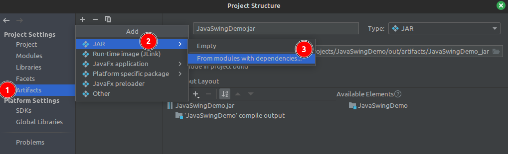

# JavaSwingDemo

- Se hace una pantalla de login
  - contiene:
    - 2 literales usuario y clave y dos campos de texto, el segundo de tipo password
    - 2 botones, uno para hacer login y otro para salir
    - 1 Menú Archivo con una opcion de salir
  - Responde los botones y el menú salir a los eventos correspondientes
    - login valida 
      - si están rellenos los campos usuario y clave,
        - da la bienvenida al usuario 
        - sino indica el error
    - salir tanto desde el boton como desde el menú sale de la aplicación pero por consola indica desde donde ha salido
    - La X de la ventana también sale pero no indica nada en consola.

## Jar ejecutable

- En **Intellij IDEA**, sobre el proyecto se le agrega la capacidad de generar jar
  - paso 1) el artifact de jar
    - desde el meno _File / Project Structure / Project Setting / Artifact_
      
    - Con esto se crea el fichero `MANIFEST.MF` que se utiliza desde para generar el fichero jar ejecutable 
  - paso 2) generar el jar 
    - desde el menú _Build / Build Artifacts ..._
     
    - resultado de la compilación
      - `out/artifacts/JavaSwingDemo_jar/JavaSwingDemo.jar`
  - paso 3) ejecución del jar
    - lanzar este comando: `java -jar out/artifacts/JavaSwingDemo_jar/JavaSwingDemo.jar` 